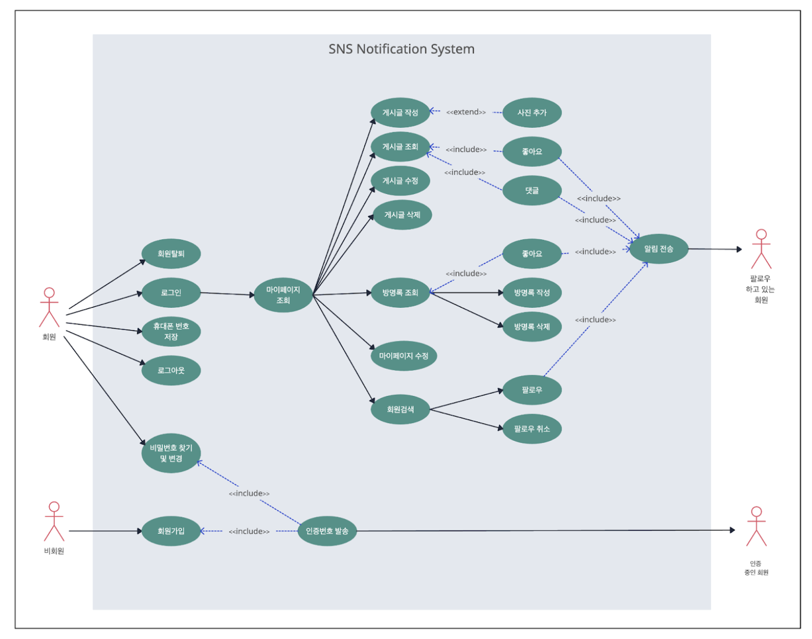
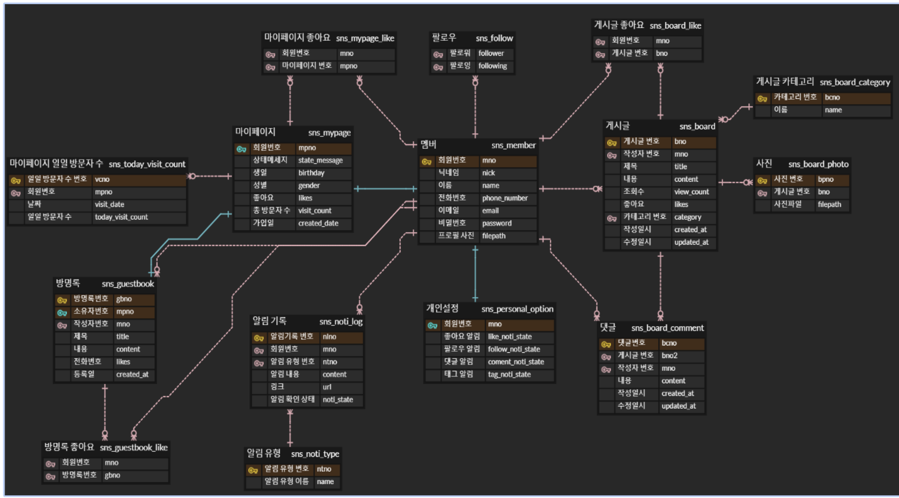
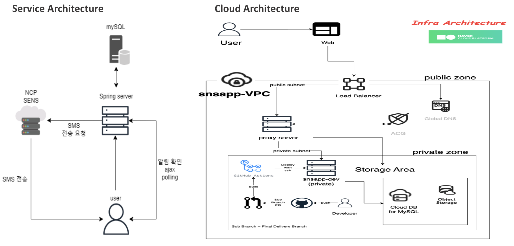

# sns-notification-system

## 프로젝트 주제 및 선정 배경 : 
현대인들이 위로와 공감을 받을 수 있는 플랫폼을 구축
## 프로젝트 개요 :
본 교육과정에서 배운 Spring-boot, Thymeleaf,  Java, JavaScript, Ajax, CSS/HTML, MySQL, NaverCloud Flatform Service, … 등을 이용하여 sns 알림 시스템을 구축

>프로젝트 구조 : 프로젝트 설계 -> 서비스 구축 -> 디버깅 -> 마무리
>>기대 효과 : 힐링스타그램을 통해 현대인들이 위로와 공감을 받을 수 있는 공간 제공 효과를 기대

## 개발 환경 service : 
Github, IntelliJ, Visual Studio Code, eXERD, ERDCloud, Figma, Naver Cloud Platform(Simple & Easy Notification Service, Object Storage, Image Optimizer, Cloud DB for MySQL, Global DNS, VPC, Server, Load Balancer) Github Action
## 개발 Skill : 
Java, Spring-boot, Mybatis, MySQL, Thymeleaf, JavaScript, Ajax, CSS/HTML, SSH Tunneling

## usecase

## ERD

## Architecture

